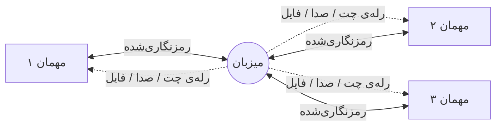

[README.md](https://github.com/user-attachments/files/32817551/README.md)

# Virtual LAN Platform

**شبکه‌ی مجازی نظیر‌به‌نظیر برای بازی، چت، صدا و اشتراک فایل — بدون سرور، بدون تنظیم روتر**
A peer-to-peer virtual LAN for gaming, chat, voice and file sharing — no server, no router setup

**[⬇ دانلود](https://github.com/parhamzare139/VirtualLANPlatform/releases/latest) · [📋 تغییرات نسخه‌ها](https://github.com/parhamzare139/VirtualLANPlatform/releases) · [🐞 گزارش مشکل](#پشتیبانی-و-گزارش-مشکل) · [💛 حمایت از پروژه](https://reymit.ir/vlanplatform) · [🇬🇧 English](#-english)**

---

## Virtual LAN Platform چیست؟

یک آداپتور شبکه‌ی مجازی واقعی روی ویندوز می‌سازد — با درایور هسته‌ای [WinTun](https://www.wintun.net/) که پشت WireGuard هم هست — و چند کامپیوتر را روی اینترنت طوری به هم وصل می‌کند که انگار همه روی یک شبکه‌ی محلی واقعی نشسته‌اند. هر بازی یا برنامه‌ای که به دنبال بازی‌های LAN می‌گردد، همین شبکه را می‌بیند؛ بدون سرور مرکزی، بدون Hamachi، بدون باز کردن دستی پورت روی روتر هر بازیکن.

کنار شبکه‌ی مجازی، یک اتاق کامل هم داخل خودِ برنامه هست: چت متنی، تماس صوتی با حذف نویز، اشتراک صفحه، و انتقال فایل مستقیم بین نفرات — همه از همان یک اتصال رمزنگاری‌شده، بدون نیاز به دیسکورد یا برنامه‌ی جداگانه.

|  |  |  |
|:---:|:---:|:---:|
| 🎮 **بدون سرور** | 🔒 **رمزنگاری end-to-end** | 🇮🇷 **کاملاً فارسی** |
| میزبان = یکی از خود بازیکن‌ها | کلید تازه برای هر نشست، مثل Signal | راست‌به‌چپ، با پشتیبانی انگلیسی |

---

## ✨ ویژگی‌ها

### 🎮 شبکه‌ی مجازی
- آداپتور شبکه‌ی واقعی روی ویندوز (WinTun) — هر بازی یا برنامه‌ی LAN-only همین شبکه را می‌بیند
- توپولوژی ستاره‌ای: یک میزبان و چند مهمان؛ فقط میزبان نیاز به باز بودن پورت دارد، ترافیک بین مهمان‌ها از او رله می‌شود
- تشخیص خودکار NAT با UPnP + STUN، شامل تشخیص NAT اپراتوری (Carrier-Grade NAT) که باز کردن پورت را اصلاً ممکن نمی‌کند
- **پایدارساز شبکه**: روی خطی که واقعاً پکت گم می‌کند، بسته‌های کوچک real-time دوبار فرستاده می‌شوند تا قطعی حس نشود
- هر عضو یک IP ثابت و منحصربه‌فرد دارد؛ میزبان پکتی که آدرس مبدأش جعلی باشد را رد می‌کند

### 💬 چت، صدا و اشتراک صفحه
- چت متنی با ایموجی سه‌بعدی، ریپلای، حذف پیام (فقط برای نویسنده‌اش)، پیش‌نمایش عکس
- **تیک دیده‌شدن** — تیک دوم فقط وقتی می‌خورد که پیام واقعاً روی صفحه‌ی طرف مقابل بوده باشد
- صدای زنده روی Opus: حذف نویز طیفی، تنظیم خودکار بلندی، و جبران پکت‌های گم‌شده از روی افزونگی خودِ کدک
- Push-to-talk با کلید دلخواه، نشانگر «در حال صحبت» کنار اسم هر نفر
- اشتراک صفحه همراه با صدای سیستم
- انتقال فایل مستقیم (P2P) تا **۶۴ گیگابایت**، به‌طور همزمان به چند نفر، با تأیید SHA-256

### 🔒 امنیت
- **ECDH P-256 + AES-256-GCM** برای هر اتصال، با کلید جداگانه برای هر جهت و کلید تازه در هر نشست
- **کد امنیتی** قابل مقایسه بین دو طرف — دقیقاً مثل Signal و واتس‌اپ، برای تشخیص حمله‌ی مرد میانی
- هویت فرستنده از روی خودِ اتصال تعیین می‌شود، نه از محتوای پیام — جعل هویت یا حذف پیام دیگران ممکن نیست
- پنجره‌ی ضد replay، پاک‌سازی نام فایل/پیام در برابر کاراکترهای مخرب (مثل RTL override که پسوند فایل را قایم می‌کند)
- فایل‌های دریافتی مثل دانلود از اینترنت علامت می‌خورند تا ویندوز پیش از اجرا هشدار بدهد
- به‌روزرسانی فقط از GitHub روی TLS، با تأیید **SHA-256** پیش از اجرای فایل نصب

### 🎨 تجربه‌ی کاربری
- کاملاً فارسی (راست‌به‌چپ) و انگلیسی، با تم تیره و روشن
- اجرا در پس‌زمینه (Tray)، شروع خودکار و بی‌صدا با روشن شدن ویندوز
- صداهای اعلان قابل شخصی‌سازی — می‌توانید صدای خودتان را جای هر کدام بگذارید
- طراحی روان با بلور ملایم پشت دیالوگ‌ها

---

## 🚀 نصب و شروع سریع

1. از **[صفحه‌ی ریلیز](https://github.com/parhamzare139/VirtualLANPlatform/releases/latest)** فایل `VirtualLANPlatform_Setup_*.exe` را دانلود و اجرا کنید.
2. اجازه‌ی دسترسی ادمین را بدهید — فقط برای نصب درایور آداپتور مجازی و یک قانون فایروال لازم است، هر دو مخصوص همین شبکه‌ی مجازی.
3. یک نفر روی **«ساخت روم»** بزند و کد/آدرس را برای بقیه بفرستد؛ بقیه با **«اتصال»** وصل شوند.
4. بازی یا برنامه‌تان را طوری تنظیم کنید که دنبال بازی روی LAN بگردد — آدرس شبکه‌ی مجازی (`10.88.x.x`) را همان‌جا می‌بینید.

| نیازمندی | مقدار |
|---|---|
| سیستم‌عامل | ویندوز ۱۰ (نسخه ۱۸۰۹ به بعد) یا ویندوز ۱۱، فقط ۶۴ بیتی |
| Runtime | .NET 8 Desktop Runtime — اگر نصب نباشد، خودِ نصب‌کننده دانلودش می‌کند |
| دسترسی | ادمین، یک‌بار برای درایور آداپتور مجازی |
| حافظه‌ی مصرفی | حدود ۲۰۰ مگابایت حین اجرا |

---

## 🧭 چطور کار می‌کند

توپولوژی ستاره‌ای: هر مهمان فقط یک اتصال مستقیم به میزبان دارد و کلید رمزنگاری‌اش هم مخصوص همان یک اتصال است. پیام یا صدایی که قرار است به همه برسد، از میزبان رله می‌شود — بدون این‌که میزبان بتواند جای کسی وانمود کند، چون هویت هر پیام از روی اتصالی که از آن آمده تعیین می‌شود، نه از چیزی که داخل خودش نوشته.

برای شبکه‌ی مجازی، میزبان روی پورت پیش‌فرض **۴۲۷۷۷** (روم) و **۴۲۷۷۸** (VLAN) گوش می‌دهد. برنامه با UPnP سعی می‌کند این پورت را خودش روی روتر باز کند؛ اگر نشد یا روتر UPnP نداشته باشد، راهنمای باز کردن دستی را نشان می‌دهد — و با مقایسه‌ی STUN تشخیص می‌دهد که آیا اصلاً این باز کردن پشت NAT اپراتور شما ممکن هست یا نه.

---

## 🛠️ زیر کاپوت

| لایه | فناوری |
|---|---|
| رابط کاربری | WPF روی .NET 8 |
| شبکه | [LiteNetLib](https://github.com/RevenantX/LiteNetLib) (UDP) + [WinTun](https://www.wintun.net/) برای آداپتور مجازی |
| صدا | Opus (از طریق Concentus) + NAudio |
| رمزنگاری | ECDH P-256 · AES-256-GCM · HKDF — پیاده‌سازی خودِ .NET |
| ذخیره‌سازی محلی | SQLite |

---

## 🔐 امنیت و حریم خصوصی

- هیچ سرور میانی‌ای بین کاربران نیست؛ میزبان خودِ یکی از بازیکن‌هاست و ترافیک فقط از دستگاه‌های شرکت‌کننده رد می‌شود.
- هر اتصال یک تبادل کلید **ECDH روی P-256** انجام می‌دهد و کلید AES-256-GCM را با HKDF از آن مشتق می‌کند — یعنی حتی اگر یک نشست بعداً لو برود، نشست‌های قبلی و بعدی همچنان امن‌اند.
- هر جهت (رفت/برگشت) کلید و شمارنده‌ی جدای خودش را دارد؛ یک پنجره‌ی ۸۱۹۲‌تایی جلوی پخش دوباره‌ی یک پکت را می‌گیرد.
- یک **کد امنیتی** کوتاه به هر دو طرف نشان داده می‌شود که می‌توانند از یک کانال دیگر (مثلاً صدا) با هم مقایسه کنند — دقیقاً همان مکانیزمی که سیگنال و واتس‌اپ برای اطمینان از نبودِ حمله‌ی مرد میانی استفاده می‌کنند.
- نام کاربری، نام فایل و متن پیام پیش از نمایش پاک‌سازی می‌شوند — از جمله در برابر کاراکتر «بازگرداندن جهت نوشتار» که برای قایم کردن پسوند واقعی یک فایل اجرایی استفاده می‌شود.
- فایلی که از کسی دیگر می‌رسد با همان نشانه‌ای علامت می‌خورد که مرورگرها روی دانلودها می‌گذارند (Mark of the Web)، تا ویندوز پیش از اجرا هشدار بدهد.
- فایل به‌روزرسانی فقط از دامنه‌های GitHub روی TLS دانلود می‌شود و پیش از اجرا با هش **SHA-256** اعلام‌شده در مانیفست تأیید می‌شود.

جزئیات فنی کامل در سورس‌کد و در [یادداشت‌های هر نسخه](https://github.com/parhamzare139/VirtualLANPlatform/releases) مستند شده‌اند.

---

## 🛟 پشتیبانی و گزارش مشکل

- **داخل برنامه:** تنظیمات ← گزارش مشکل — یک بسته‌ی تشخیصی می‌سازد و آدرس ایمیل را برایتان آماده می‌کند.
- **ایمیل:** [vlanplat.help@gmail.com](mailto:vlanplat.help@gmail.com)
- **گزارش باگ عمومی:** [GitHub Issues](https://github.com/parhamzare139/VirtualLANPlatform/issues)
- اگر برنامه به کارتان آمد و خواستید حمایت کنید: **[reymit.ir/vlanplatform](https://reymit.ir/vlanplatform)**

---

## ❓ سوالات متداول

چرا برنامه به دسترسی ادمین نیاز دارد؟
 

برای نصب درایور آداپتور شبکه‌ی مجازی (WinTun) و اضافه کردن یک قانون فایروال مخصوص همان آداپتور. این کار فقط یک‌بار موقع اولین اجراست، نه هر بار.

آیا جایگزین Hamachi یا Radmin VPN است؟
 

از نظر کاربرد (ساختن یک LAN مجازی برای بازی‌های قدیمی) هدف مشابهی دارد، ولی معماری رمزنگاری، و چت/صدا/اشتراک‌فایل داخلی، بخشی جدا و اضافه است که آن‌ها ندارند.

روی مک یا لینوکس کار می‌کند؟
 

فعلاً نه — به‌خاطر درایور WinTun و رابط کاربری WPF، فقط ویندوز ۱۰ (۱۸۰۹ به بعد) و ۱۱، هر دو ۶۴ بیتی.

آیا کسی می‌تواند چت یا صدای من را ببیند؟
 

تمام ترافیک بین شرکت‌کننده‌ها با کلیدی که مخصوص همان یک نشست ساخته می‌شود رمزنگاری است. هیچ سرور میانی‌ای هم وجود ندارد که چیزی از آن رد شود.

سورس باز است؟
 

نه؛ رایگان برای استفاده‌ی شخصی، ولی سورس بسته و مالکیت آن نزد نویسنده است. جزئیات کامل در <a href="LICENSE">LICENSE</a>.

چطور بفهمم آخرین نسخه را دارم؟
 

برنامه خودش هنگام باز شدن (و از داخل تنظیمات، هر وقت بخواهید) نسخه‌ی جدید را چک می‌کند و اگر بود، دانلود و نصبش را قدم‌به‌قدم پیش می‌برد.

---

## 📜 مجوز

**Proprietary Freeware** — رایگان برای استفاده‌ی شخصی و غیرتجاری؛ سورس‌کد باز نیست و کپی، تغییر یا توزیع مجدد سورس مجاز نیست. توزیع خودِ فایل نصب/اجرایی بدون تغییر آزاد است. متن کامل: **[LICENSE](LICENSE)**.

## 🙏 با تشکر از

- **[WinTun](https://www.wintun.net/)** (پروژه‌ی WireGuard) — MIT License
- **[Vazirmatn](https://github.com/rastikerdar/vazirmatn)** — SIL Open Font License، برای رندر درست متن فارسی
- زیرمجموعه‌ای از **[fluent-emoji](https://github.com/bignutty/fluent-emoji)** (bignutty) — MIT License

ساخته‌شده برای بازی و کار گروهی بدون سرور، بدون پیچیدگی.

---
---

# 🇬🇧 English

**A peer-to-peer virtual LAN for gaming, chat, voice and file sharing — no server, no router setup.**

Virtual LAN Platform creates a real virtual network adapter on Windows — using [WinTun](https://www.wintun.net/), the same kernel driver behind WireGuard — and links several computers over the internet as if they were sitting on one physical LAN. Any game or application that looks for a local network sees this one; there is no central server, no Hamachi-style relay company, and no manual port forwarding for anyone except the host.

Alongside the virtual network, the app carries its own room: text chat, noise-suppressed voice calls, screen sharing, and direct peer-to-peer file transfer — all over the same encrypted connection, with no need for a separate voice app.

### Highlights

- **Virtual LAN** — a real Windows network adapter (WinTun); star topology, so only the host needs an open port; automatic UPnP/STUN port mapping with carrier-grade NAT detection; a network stabilizer that duplicates small real-time packets on a lossy link.
- **Chat, voice & screen share** — replies, per-image previews, author-only delete, Telegram-style read receipts; Opus voice with spectral noise suppression, automatic gain, and loss concealment from the codec's own redundancy; push-to-talk; direct file transfer up to **64 GB** to several recipients at once, SHA-256 verified.
- **Security** — ECDH P-256 + AES-256-GCM per connection with a fresh key every session and a separate key per direction; a comparable safety code, the same mechanism Signal and WhatsApp use against man-in-the-middle attacks; sender identity comes from the connection itself, never from the message; a replay window; file-name sanitisation (including the RTL-override trick that disguises an executable as an image); downloaded files are marked as from the internet; updates are pinned to GitHub over TLS and verified against a SHA-256 hash before running.
- **Interface** — fully localised into Persian (RTL) and English, dark/light themes, runs from the tray, custom notification sounds.

### Quick start

1. Download `VirtualLANPlatform_Setup_*.exe` from the **[latest release](https://github.com/parhamzare139/VirtualLANPlatform/releases/latest)**.
2. Grant administrator access — needed once, only to install the virtual adapter driver and its firewall rule.
3. One person creates a room and shares the address; everyone else connects.
4. Point your LAN-only game or app at the virtual network — its `10.88.x.x` address is shown right in the app.

| Requirement | Value |
|---|---|
| OS | Windows 10 (1809+) or Windows 11, 64-bit only |
| Runtime | .NET 8 Desktop Runtime — installed automatically if missing |
| Access | Administrator, once, for the virtual adapter |
| Memory | ~200 MB while running |

### Support

- In-app: Settings → Report a problem
- Email: [vlanplat.help@gmail.com](mailto:vlanplat.help@gmail.com)
- Bugs: [GitHub Issues](https://github.com/parhamzare139/VirtualLANPlatform/issues)
- Found it useful? **[Support the project](https://reymit.ir/vlanplatform)**

### License

**Proprietary Freeware** — free for personal, non-commercial use; the source is not open and may not be copied, modified or redistributed. Sharing the unmodified installer/executable is permitted. Full text: **[LICENSE](LICENSE)**.

[⬆ بازگشت به بالا / Back to top](#virtual-lan-platform)

